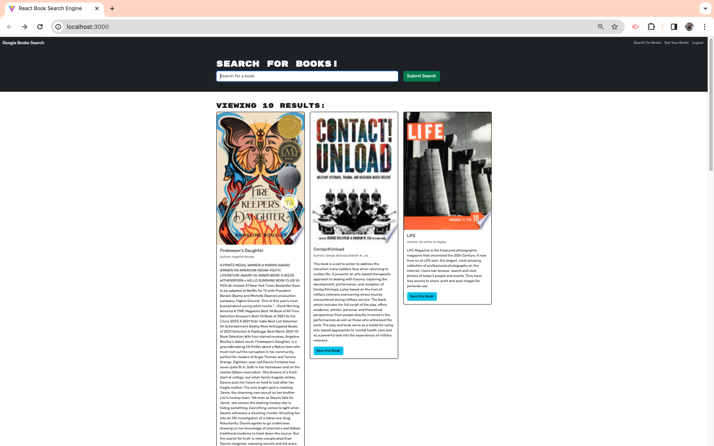
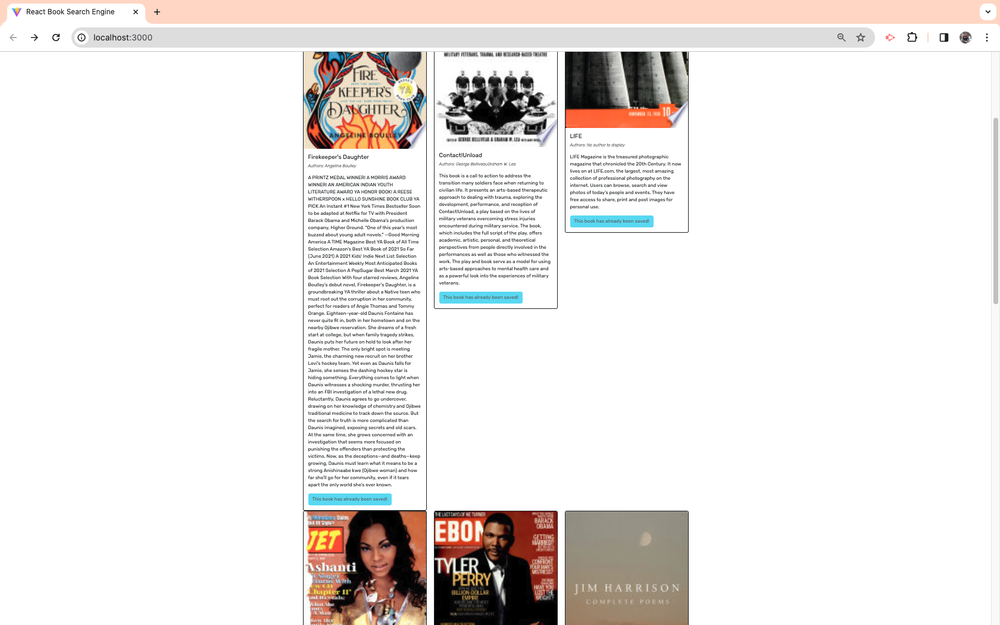
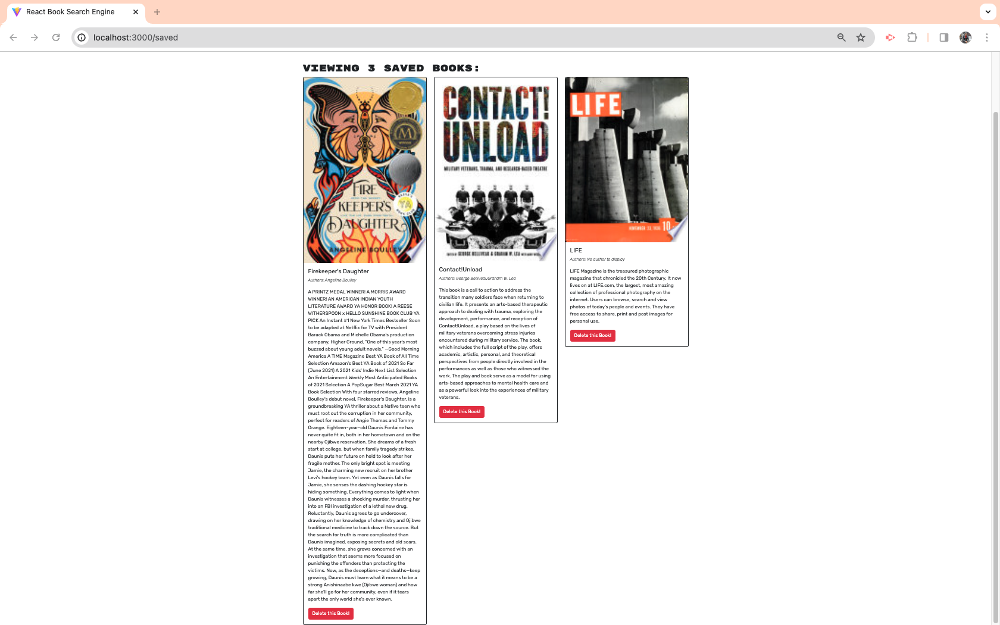
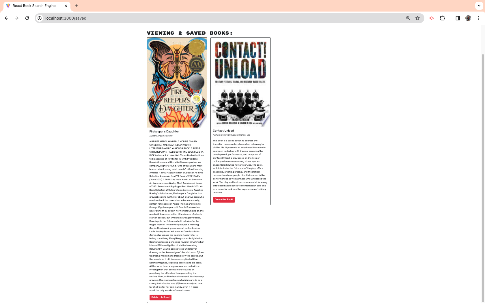

  [](https://opensource.org/licenses/MIT)

  # Title
  BOOKSEARCH-APP 
  
  ## Description
  This apps allows you to search the related books you want using google api and enables you to save the favourite books where you can manage the collection of books. This apps is complete MERN application which demonstrate the use of mongodb, expressjs,react and nodejs along with GRAPHQL API made with apollo server. It is deployed on Heroku and uses mongoDB Atlas for data storage.

 
  
  ## Table of Contents

  - [Installation](#Installation)
  - [Features](#features)
  - [Usage](#usage)
  - [Links](#links)
  - [credits](#credits)
  - [License](#license)
  
  ## Installation

  To execute ThoughtSHARE in your machine
  1. Clone the repository using command line ``git clone``
  2. Run command : ```npm install or i``` to install dependencies for both client and server
  3. Create .env file and add atlas URL as MONGODB_URI
  4. Run the application with run command: ``` npm run develop ```

  ## Features
  - User can sign in and log out to their accounts
  - User can search books using google books API
  - Manage the collection of books like add, remove the books
  - User authentication is secure and robust


 ## Usage

- Sign up ,log in to the application
- Search and add books and remove books and manage collection accordingly

 ## Screenshots

 
  
   
    


  ## links
- Link of my [Github repository](https://github.com/Sabinkthapa/BookSearchEngine.git)
- Netlify [Netlify] (https://storebook-app.netlify.app/)

  ## Credits
- npm: [node Package manager](https://www.npmjs.com)
- Expressjs: [nodejs popular web framework](https://expressjs.com)
- Mongo: [Documentation of MongoDB](https://www.mongodb.com/)
- link of connecting app with Mongo Atlas (https://coding-boot-camp.github.io/full-stack/mongodb-deploy-with-heroku-and-mongodb-atlas)

  ## MIT License

Copyright (c) 2023 Sabin Thapa

Permission is hereby granted, free of charge, to any person obtaining a copy
of this software and associated documentation files (the "Software"), to deal
in the Software without restriction, including without limitation the rights
to use, copy, modify, merge, publish, distribute, sublicense, and/or sell
copies of the Software, and to permit persons to whom the Software is
furnished to do so, subject to the following conditions:

The above copyright notice and this permission notice shall be included in all
copies or substantial portions of the Software.